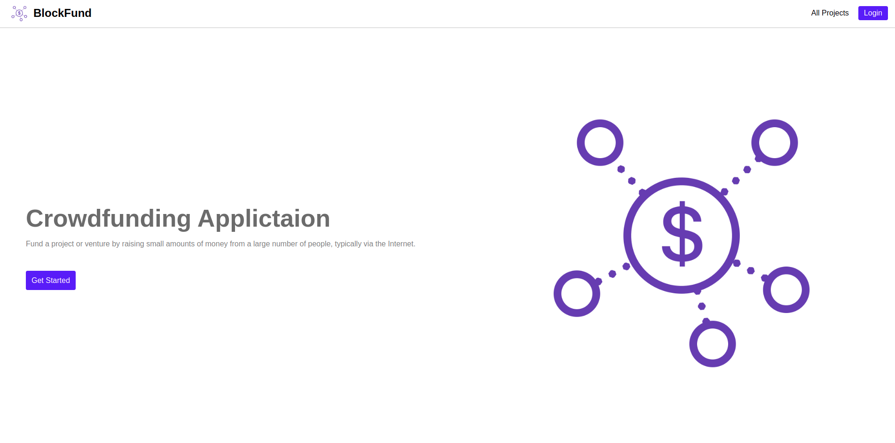
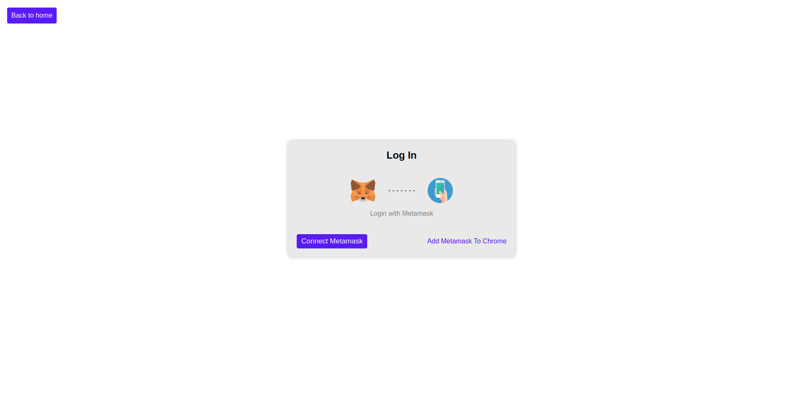
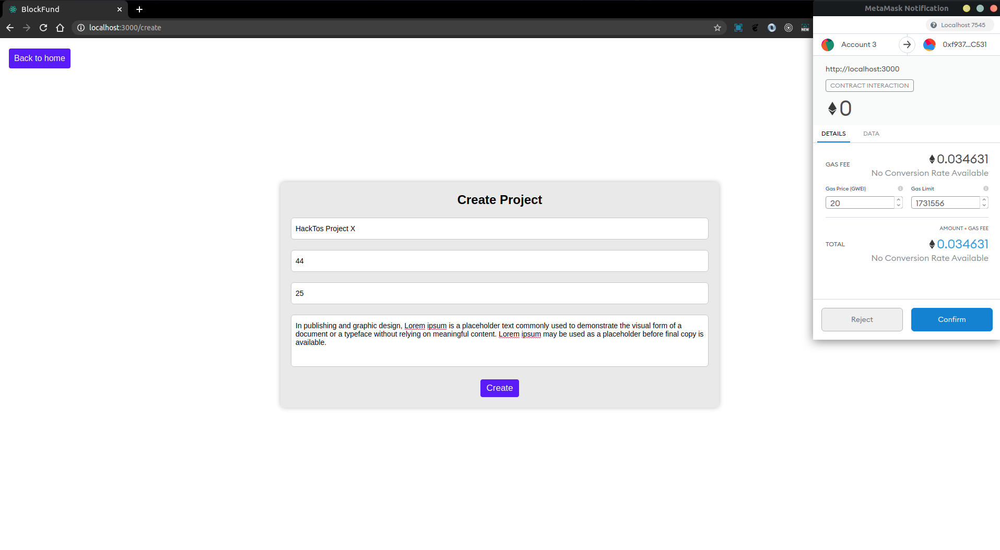
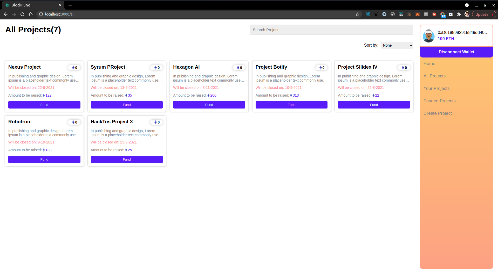
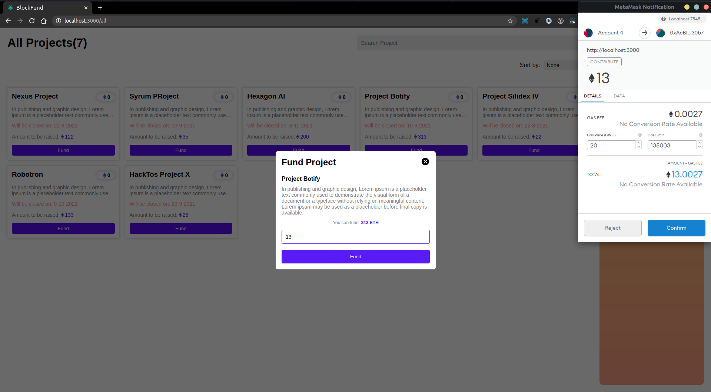
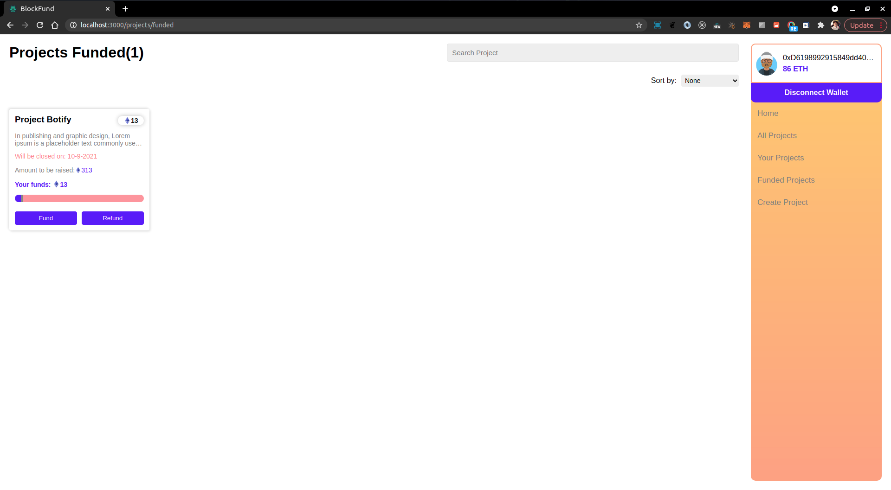

<h1 align="center">Crowdfunding Web App</h1>
  <p align="center">
    A basic crowdfunding web app with ethereum blockchain.    <br />
    <a href="https://github.com/DebjitPramanick/Blockchain-Crowdfunding-App/issues">Report Bug</a>
    ·
    <a href="https://github.com/DebjitPramanick/Blockchain-Crowdfunding-App/issues">Request Feature</a>
  </p>
</p>


<!-- TABLE OF CONTENTS -->
<details open="open">
  <summary>Table of Contents</summary>
  <ol>
    <li>
      <a href="#about-the-project">About The Project</a>
      <ul>
        <li><a href="#built-with">Built With</a></li>
      </ul>
    </li>
    <li>
      <a href="#getting-started">Getting Started</a>
      <ul>
        <li><a href="#prerequisites">Prerequisites</a></li>
        <li><a href="#installation">Installation</a></li>
      </ul>
    </li>
    <li><a href="#roadmap">Roadmap</a></li>
    <li><a href="#contributing">Contributing</a></li>
    <li><a href="#contact">Contact</a></li>  </ol>
</details>


<!-- ABOUT THE PROJECT -->
## About The Project


<br>

This is a simple crowdfunding web app using Blockchain technology.
A list of commonly used resources that I find helpful are listed in the acknowledgements.

### Built With
* [React](https://reactjs.org/)
* [Truffle](https://www.trufflesuite.com/truffle)
* [Ganache](https://www.trufflesuite.com/ganache)
* [Solidity](https://docs.soliditylang.org/en/v0.8.4/)
* [Ethereum](https://ethereum.org/en/)


<!-- GETTING STARTED -->
## Getting Started

To get a local copy up and running follow these simple example steps.

### Prerequisites

These things must be installed in your system.
* [Truffle](https://www.trufflesuite.com/truffle)
* [Ganache](https://www.trufflesuite.com/ganache)
* [NPM](https://nodejs.org/en/)

This things must be installed as an extension in your browser.
* [Metamask](https://chrome.google.com/webstore/detail/metamask/nkbihfbeogaeaoehlefnkodbefgpgknn?hl=en)

### Installation

1. Clone the repo
   ```sh
   https://github.com/DebjitPramanick/Blockchain-Crowdfunding-App
   ```
2. Open the project folder
3. Install NPM Packages
	```sh
   npm i @openzeppelin/contracts@2.5.1
   ```
4. Now run Ganache
5. Now type in the command in terminal
    ```sh
   truffle migrate
   ```
6. Now type
    ```sh
   cd client
   ```
7. Intsall NPM Packages for client
   ```sh
   npm i
   ```
9. Now start the client application
    ```sh
   npm start
   ```
   
<!-- USAGE EXAMPLES -->
## Usage

Here are some examples of how my app works.
<br>

<br>

<br>

<br>

<br>

<br>

